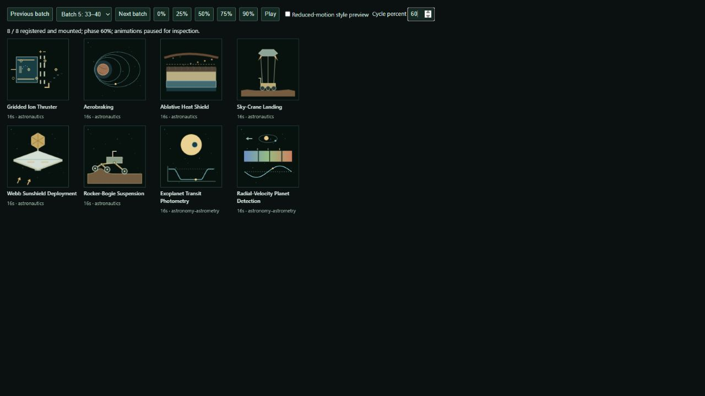

# Resumed gallery expansion — operator handoff

Completed locally on 2026-09-09. The gallery now contains **1,000 active studies**
and **1,001 preserved records**, organized into **13 sections and 66 categories**.
All 56 additions have passed source review and actual browser render inspection.

## 1. Decisions made

The latest operator instruction resumed expansion after revisions and retirement.
D-008 supersedes the earlier stop on additions. The thousand-animation marker is
interpreted as 1,000 active studies; the retired Wind Rose remains a separate
preserved record. No existing study was reactivated to reach the target.

The initial assessment found 944 active / 945 preserved studies, the five approved
Wave 01 refinements already committed, and expected uncommitted Wave 02 work:
16 approvals, three pending revisions and one retirement. The complete metadata
and source hashes of all 945 records were captured before gallery edits. They are
unchanged at completion. Existing campaign feedback and pending work remain intact.

All 55 formerly deferred subjects S061–S115 were reconsidered against the revised
catalog and retained. S116, Frost Heave by Ice-Lens Growth, adds a distinct
ground-ice mechanism: water migration and segregated ice lift soil, whereas the
thermokarst study depicts loss of ice-supported ground. This additional subject
accounts for the retirement while preserving exactly 1,000 active studies.

| Addition group | Studies | Canonical metadata |
| --- | ---: | --- |
| Hydrology, climate and ground ice | 13 | [Earth shard](../../../../concepts/gallery/manifests/resumed-earth.js) |
| Structures, treatment and logistics | 16 | [Civil shard](../../../../concepts/gallery/manifests/resumed-civil.js) |
| Spaceflight and astronomical measurement | 17 | [Space shard](../../../../concepts/gallery/manifests/resumed-space.js) |
| Economics and collective behavior | 10 | [Economics shard](../../../../concepts/gallery/manifests/resumed-economics.js) |
| **Total** | **56** | [Complete identity and placement list](selection.json) |

Three categories were added within existing sections: Climate & Cryosphere (6),
Civil Infrastructure & Logistics (16), and Economics & Collective Systems (10).
Other additions extend Oceanography & Hydrology, Geology & Earth Processes,
Astronautics & Spaceflight, and Astronomy & Astrometry. Every study has one
canonical module and placement. Cross-disciplinary associations use metadata.

The definition, defining motion, modeling assumptions, distinction, facets and
primary references belong to the canonical shards linked above. The visible
About control presents the definition and motion description. Research includes
USGS, NOAA, WHOI, FEMA, EPA, NASA and other subject authorities; economic models
are presented as explicit illustrative mechanisms, not universal predictions.

## 2. Decisions deferred

No selected expansion subjects remain deferred. The historical 945-record
delivery and its original deferred list remain unchanged as checkpoint evidence;
the resumed delivery explicitly resolves that list.

The separate Visual Standard Campaign remains open under LOOP-002. Nocturnal
dial, octant and heliograph still require the previously requested revisions.
The campaign's six other deferred subjects and all operator feedback remain in
its existing records. Wind Rose may be reconsidered only on operator request.

Commit, push, merge, release and deployment remain outside this pass. The
operator can inspect the local result before authorizing publication. The
resumed expansion itself is closed under LOOP-003; no further additions are needed.

## 3. Critical issues

No unresolved critical issue was found in this expansion. Important limits:

- The 56 new studies were all inspected at four deterministic phases and in
  their actual reduced-motion CSS poses. This verifies the styles and readable
  static compositions. An operating-system preference change and actual hidden
  browser-document transitions were not exercised. The preserved JavaScript
  Nixie preference-change/remount regression test passes.
- Source-bound review evidence remains valid for all 341 expansion sources
  (285 earlier plus 56 resumed). All 945 baseline records were checked for
  exact preservation; this pass does not claim a fresh visual re-review of every
  historical tile. The pending campaign revisions remain visible limitations.
- Browser QA used the local Chromium-based in-app browser at its default desktop
  size and a 390 × 844 mobile viewport. Cross-engine behavior and device performance
  were not measured. The scenes are compact explanatory models, not engineering,
  scientific forecasting or economic decision tools; assumptions are recorded.
- The working tree was already dirty and remains dirty. Existing campaign changes
  are expected and preserved. The local build has not changed the deployed site.

## 4. Changes and verification

All 56 custom elements are standalone modules with open Shadow DOM, CSS animation,
off-screen lifecycle handling, disconnect cleanup and intentional reduced-motion
poses. Authoring utilities produce sampled geometry and combine properties for
the same animated actor, but introduce no shared runtime scene dependency.
Four new manifest shards are imported directly by the canonical manifest.

Read-only specialist reviews covered every new subject. Corrections were made
before final render acceptance, including:

- Earth: confined-aquifer geometry; equal input water units in runoff comparisons;
  complete meander sediment plugs; shelf restraint/contact; a moving thermokarst
  headwall with slope-aligned blocks; condensation and rain tied to a windward
  parcel; and ice-lens growth synchronized with soil lift and water supply.
- Civil: connected structural deformation and force directions; force arrows
  collapsing at zero; distinct sediment/floc paths and uptake timing; traffic
  gaps and turn tangents; rail-current connections inside insulated boundaries;
  and crane locks released before the empty spreader lifts. Dense interpolated
  checks reported minimum visible clearances of 0.692 px for clarifier grains,
  4.38 px for flocs, and 5.43 px for roundabout traffic.
- Space: momentum-consistent reaction-wheel motion; acceleration and braking
  before docking; ion-grid speeds; eccentric-orbit phase; rover/bridle clearances;
  rigid deployment and suspension links; transit area/contact geometry; radial
  velocity phase; interferometer baselines; optical phase and correction signs;
  sample retention; and aerogel entry/deceleration. The suspension review checked
  28/55-unit links over 481 poses with error below 2e-13 before SVG rounding.
- Economics: stock and ticket identity through transfers; separated trade paths;
  timed banking liquidation with four of six claims paid; visible auction award;
  contribution paths; common-pool diversion; and a deterministic Schelling run
  preserving 28 households and eight vacancies through nine legal moves. Bullwhip
  bars explicitly represent order requests, with upstream peaks of 3, 4, 6 and 10.

Final QA consists of seven batches of eight studies, each at 5%, 35%, 60% and 90%
of its cycle plus a reduced-motion pose: **224 phase observations and 56 static
observations in 35 final contact sheets**. Every new element registered, every
static preview had zero running CSS animation, and rendered artifact bytes matched
the reviewed source. [The ledger](visual-qa/review-ledger.json) binds each subject
to its SHA-256 and exact images. Earlier draft captures in the folder are not
counted as final acceptance evidence.

| Verification | Result |
| --- | --- |
| `npm test` | PASS: 1,001 unique valid records; 660 historical entries preserved with the declared Nixie compatibility edit and 25 additive refinements; all 945 resumed baseline sources/metadata unchanged; queue, retry, lifecycle, provenance and clipboard tests pass |
| `npm run build` | PASS: 1,111 allowlisted artifact files |
| `npm run site:check` | PASS: 10 HTML files, 1,111 artifact files, four sitemap URLs |
| `npm run security:check` | PASS: 10 public HTML files and shared JavaScript |
| `npm run gallery:acceptance` | PASS: 1,000 active / 1,001 preserved; 56 new plus 285 prior reviewed expansion sources; all 55 deferred identities and placements retained |
| `git diff --check` | PASS; Git only reports its existing LF-to-CRLF normalization notices |

Acceptance now checks original and resumed delivery accounting separately,
retirement preservation, distinct modules, exact retained subject identities and
placements, and current-source visual evidence. The stricter four-phase/five-image
rule follows resumed subject identity regardless of which ledger stores the review.

Browser verification passed: 36-item newest view; 1,000-card curated view with only
10 nearby previews mounted at the observed desktop position; zero retired Wind
Rose cards and zero matching search results; all three new category deep links
(6/16/10 results); label/topic and definition searches (`ice-lens`, `microbial flocs`);
Codex/Astra/6 filtering; readable About context; successful Copy feedback; canonical
Source links; preserved Chip Log v2 → v1 → v2 controls; and no relevant error logs.
Live economics captures show changed states over time. Returning up-page reduced
mounted previews from 10 to five, confirming removal of off-screen tiles.
At 390 px width, the 16-study civil category remained readable without horizontal
overflow (375 px document width). [Mobile capture](visual-qa/gallery-mobile-civil.png)
and [desktop capture](visual-qa/gallery-desktop-economics.png) are retained.

Documentation, public counts, taxonomy table, changelog, decisions, current state
and open loops now match the delivered scope. Temporary Python bytecode was
removed; formatting is restricted to additions outside the preservation baseline.
Review pages, generators, snapshots and reports remain excluded from the build.

Starting and ending branch: **main**. Starting and ending HEAD:
**48cf4abb2dfe597909b403da057b68381a2ff595**. The initial complete status is in
[baseline.json](baseline.json); the ending status is in [ending-status.txt](ending-status.txt).
No commit, push, release or deployment occurred. Shared weekly usage was 27% at
assessment and 39% at final review; no per-task cost is inferred from those figures.

The test preview server and temporary QA tabs are closed at handoff. The completed
sources and evidence remain available for operator inspection.
