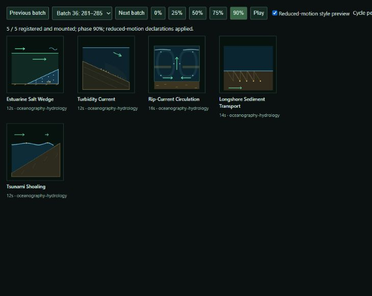

# Gallery expansion close-out

## Operator decision and repository state

The operator ended further additions and requested review and closure of completed work. The delivered scope is **945 concepts**, including **285 additions**, in **13 sections and 63 categories**. The original 1,000-entry objective is superseded; this report does not claim it was completed.

- Baseline: `main` at `e415700693c075f69eab772aca47680e17282307`, clean and synchronized with the local `origin/main` ref; 660 concepts, 9 sections, 43 categories; baseline test passed.
- The verified implementation and product documentation were locally committed
  on `main` as `5f50f196d314e472398c64c44ef636f83698c290`
  (`feat(concepts): expand gallery to 945 concepts`). This exact SHA is the
  implementation checkpoint; RAIDEN state and this complete task-owned snapshot
  are recorded in the following local close-out commit.
- All required validation passed before the implementation commit. The final
  state-only correction does not alter the implementation, so a lightweight
  catalog check is sufficient after both commits.
- No push, merge, release, deployment, dependency installation,
  `.raiden/writ/` edit, `_archive/` promotion, or production change occurred.
  The prior production release remains live and does not include this expansion.
- [delivery.json](delivery.json) is the operator-scope record. [selection.json](selection.json) retains all 510 researched candidates: 285 delivered, 55 deferred, 170 rejected. The deferred selections are exactly S061–S115, with no automatic continuation authorized.

## Delivered changes

The additions cover statistics, optimization, learning, algorithms, information theory, networks, distributed/runtime systems, human physiology and medicine, genetics/ecology, modern chemistry/materials, perception, control/robotics, instrumentation, energy, and selected ocean processes. Every addition has its own canonical module, definition, motion thesis, distinction, references, cycle, dates, and Codex/Astra/6 provenance. Descriptive facts live in manifest shards rather than duplicated research prose.

Historical metadata, tags, URLs, versions, and primary placements are preserved. 659 historical source hashes are unchanged; the sole declared source compatibility edit is Nixie Tube Display, whose live motion-preference handling and cleanup were corrected while preserving its original contribution and adding actual edit provenance.

The renderer now keeps card content in inert templates, limits concurrent imports to 4, mounts nearby active versions, unmounts off-screen instances, and caches/retries failed imports on revisit. Search includes definitions, motion, aliases, facets and taxonomy. Native About disclosures expose definitions accessibly. Provenance dimensions must match the same contribution. Version selection, stable Source URLs and Copy are preserved; clipboard fallback cleanup is tested. The newest view stays capped at 36.

Product counts, metadata, taxonomy table, authoring instructions and Unreleased changelog were updated. RAIDEN Instance state records D-005 architecture and D-006 scope closure; LOOP-001 is closed. Historical wave notes remain as dated evidence and are superseded by this report.

The final documentation review also corrected D-003's stale pending-deployment status using the earlier completed deployment recorded in OPEN_LOOPS; this does not imply deployment of the present expansion. All three task-owned preview servers were stopped, seven review tabs were closed, and browser viewport/visibility overrides were restored. One earlier browser-generated error tab could not be closed through the tool because its data URL was blocked by browser policy; it has no running preview server.

### Taxonomy additions

New sections: Data Science & Optimization; Computing; Human Health; Mind & Society.

- Mathematics & Information: Statistics & Probability.
- Data Science & Optimization: Optimization & Decision Methods; Statistical Learning.
- Computing: Algorithms & Data Structures; Information Theory & Coding; Computer Networks; Distributed Systems; Runtime & Storage.
- Chemistry: Molecular Chemistry; Materials & Processing; Industrial Chemistry.
- Human Health: Anatomy & Physiology; Neuroscience & Senses; Immunity & Medicine.
- Life Sciences: Molecular Genetics; Ecology & Evolution.
- Engineering & Technology: Energy Systems; Instrumentation & Signals; Control & Robotics.
- Mind & Society: Perception & Communication.

Existing Cellular Biology & Microbiology, Plants/Insects/Terrestrial Ecology, and Oceanography & Hydrology categories also gained subjects. Existing concepts were not reorganized.

| Section | Categories | Concepts |
| --- | ---: | ---: |
| Mathematics & Information | 4 | 60 |
| Data Science & Optimization | 2 | 16 |
| Computing | 5 | 64 |
| Physical Sciences | 11 | 177 |
| Chemistry | 5 | 64 |
| Human Health | 3 | 40 |
| Life Sciences | 6 | 108 |
| Earth & Environment | 3 | 50 |
| Astronomy & Spaceflight | 4 | 48 |
| Engineering & Technology | 10 | 162 |
| Mind & Society | 1 | 14 |
| Arts, Culture & Play | 6 | 97 |
| Imagination & Belief | 3 | 45 |
| Total | 63 | 945 |

## Review and verification

Three read-only reviewers checked scientific mechanisms/geometry, catalog preservation/metadata, and runtime changes; the primary agent remained the sole writer. Actionable findings were corrected and re-reviewed. Final corrections included complete wave-generator wiring, visible geothermal exchanger connections, static thermal-output proportions, coastal-tracer separation, and turbidity-grain/envelope clearance. No known actionable code or geometry defect remains from these reviews.

| Check | Result |
| --- | --- |
| `npm test` | 945 unique structurally valid concepts; 660 historical entries preserved; queue/retry, Nixie lifecycle, provenance and clipboard regressions pass |
| `npm run build` | 1,051 allowlisted artifact files |
| `npm run site:check` | 10 HTML files, 1,051 artifact files, 4 sitemap URLs pass |
| `npm run security:check` | 10 public HTML files and shared JavaScript pass |
| `npm run gallery:acceptance` | 945 canonical modules, 285 delivered subjects, 55 explicitly deferred selections, complete current-source visual evidence pass |
| `git diff --check` | Pass; only the repository's normal LF/CRLF notices |

### Visual review

All 285 additions registered and upgraded in the real local browser and were visually inspected at multiple deterministic cycle phases plus their reduced-motion CSS pose. [review-ledger.json](visual-qa/review-ledger.json) binds each review to the current module SHA-256, timestamp and screenshots. All 285 hashes pass. The 36 review batches include a final five-tile batch; no unreviewed authored addition remains. Local QA scripts, screenshots, selection and control-plane records are excluded from the public build.

### Gallery behavior

Final delivered-scale checks verified 36 newest cards, 945 curated cards, bounded near-viewport mounting (10 initially, 19 after the sampled desktop scroll), off-screen unmounting, all four new-section deep links, metadata search, contributor/model/version filtering, legacy version cycling, Copy/Source, and narrow 390×844 layout without horizontal overflow. Desktop screenshot content width was 1,265 px; mobile content width 375 px after scrollbar. The observed 330 ms curated action includes tool overhead and is not a performance benchmark.

Delayed imports survived actual viewport departure/re-entry, producing one upgraded host and no error after completion. An intentional 503 recovered on same-card viewport revisit, removed its error, and retained the canonical Source URL. The only error logged on that test page was the injected failure; other final gallery and contact-sheet logs were clean. Details are in [loading-race-review.md](loading-race-review.md).

## Deferred work and residual limits

- S061–S115 remain research-only candidates because the operator ended expansion. No 1,000-entry performance claim is made.
- Actual OS motion-preference switching was not verified: Windows Settings exposed no targetable window, and no setting was changed. The actual reduced-motion CSS declarations were reviewed for all 285 additions, and the Nixie live preference-change/remount regression passed.
- The browser interface kept `document.visibilityState` visible when its panel was hidden; an actual hidden-document transition remains unverified. Source guards/cleanup were reviewed, and viewport suppression/recovery was verified.
- Validation used the local Chromium-based in-app browser. Cross-browser/device hardware behavior remains outside this review; these are educational schematic animations, with model assumptions in canonical metadata.
- Push, release, and deployment remain operator decisions. The locked dependency
  graph and unrelated collections are unchanged. The Afterglows Visual Standard
  Campaign may begin from this clean local checkpoint; it has not begun.

## Inspection pointers

- `concepts/gallery/manifests/`, `manifest.js`, `taxonomy.js`: inventory, facts, placement and provenance.
- `concepts/gallery/concepts/`: 285 standalone additions plus the declared Nixie edit.
- `concepts/gallery/index.js`, `module-queue.js`, `module-loader.js`, `provenance.js`: gallery behavior.
- `scripts/validate-*`, `scripts/test-*`, `scripts/fixtures/gallery-baseline.json`: structural and behavioral checks.
- `scripts/gallery-qa.*`, `scripts/serve-gallery-qa.js`, `scripts/expansion/`: local deterministic review and authoring helpers.
- Product READMEs, gallery/root HTML, demos overview, CHANGELOG and `.raiden/state/`: synchronized documentation and closure.
